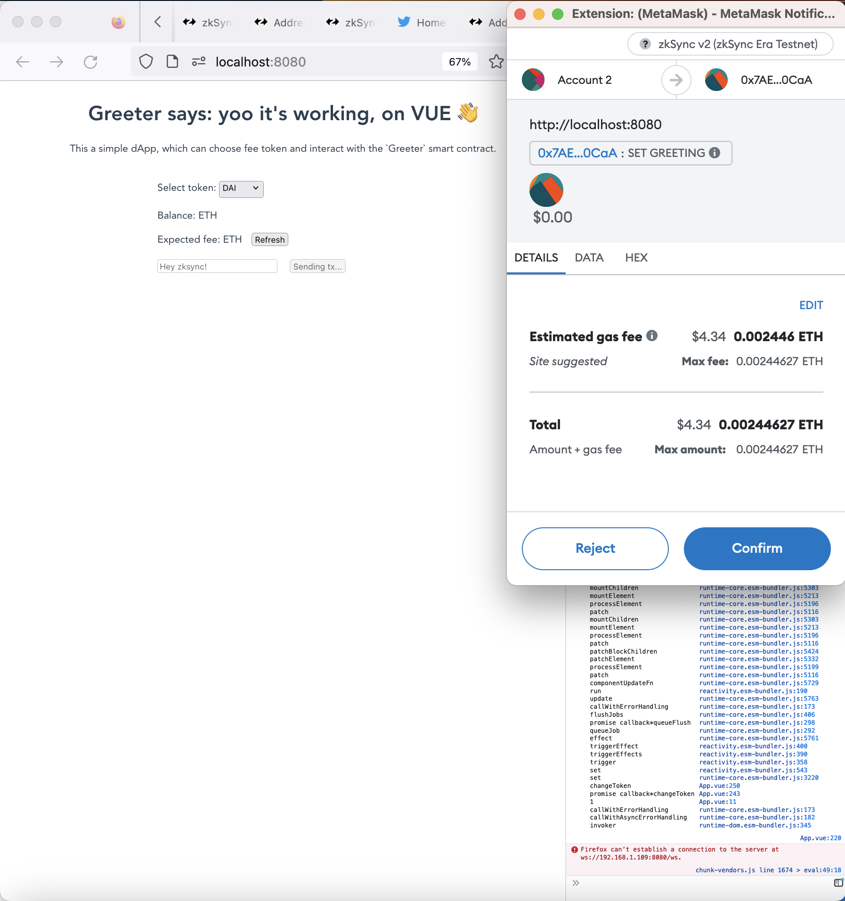

# zkSync Greeter



## Initializing the project

Install the dependencies:

```js
npm init -y
npm i -D typescript ts-node ethers@^5.7.2 zksync-web3 hardhat @matterlabs/hardhat-zksync-solc @matterlabs/hardhat-zksync-deploy
```

Create the `hardhat.config.ts` file and paste the following code there:

```ts
import '@matterlabs/hardhat-zksync-deploy';
import '@matterlabs/hardhat-zksync-solc';

module.exports = {
	zksolc: {
		version: '1.3.5',
		compilerSource: 'binary',
		settings: {},
	},
	defaultNetwork: 'zkSyncTestnet',

	networks: {
		zkSyncTestnet: {
			url: 'https://zksync2-testnet.zksync.dev',
			ethNetwork: 'goerli', // Can also be the RPC URL of the network (e.g. `https://goerli.infura.io/v3/<API_KEY>`)
			zksync: true,
		},
	},
	solidity: {
		version: '0.8.17',
	},
};
```

## Deploy

Deploying contracts with hardhat

```zsh
yarn hardhat deploy-zksync
```
